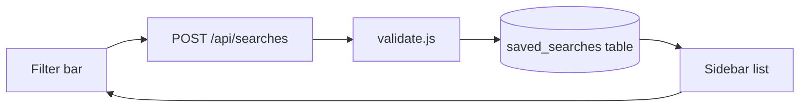

We're adding a "saved searches" feature to the app so users can name a filter set and return to it later. The work splits into a backend phase (storage + API) and a frontend phase (UI + state). Keep migrations reversible and ship behind a feature flag until the UI is wired up.

# Phase 1 — Backend

1. Add a `saved_searches` table with `id`, `user_id`, `name`, `query_json`, and `created_at`.
2. Write the migration and a matching rollback in `src/db/migrations.js`.
3. Expose CRUD routes (`list`, `create`, `delete`) in `src/server.js`.
4. Validate the incoming `query_json` payload in `src/validate.js` before it hits the database.

## Phase 2 — Frontend

1. Add a "Save this search" button to the filter bar in `web/app.js`.
2. Fetch and render the saved list in a sidebar panel.
3. Persist the active selection so a reload restores the last opened search.
4. Wire delete with an optimistic update and a rollback on failure.

## Checklist

- [x] Schema drafted and reviewed
- [x] Migration written with rollback
- [ ] CRUD routes implemented
- [ ] Payload validation added
- [ ] Filter-bar button wired
- [ ] Sidebar list rendering
- [ ] Optimistic delete

## API surface

| Method | Path                  | Body            | Returns           |
| ------ | --------------------- | --------------- | ----------------- |
| GET    | `/api/searches`       | none            | list of searches  |
| POST   | `/api/searches`       | `{name, query}` | created search    |
| DELETE | `/api/searches/:id`   | none            | `{ok: true}`      |

## Data flow

## Notes

Rate-limit the create endpoint to avoid accidental duplicate saves on double-click. The `query_json` column stays opaque to the server for now; we only validate its shape, not its semantics.
